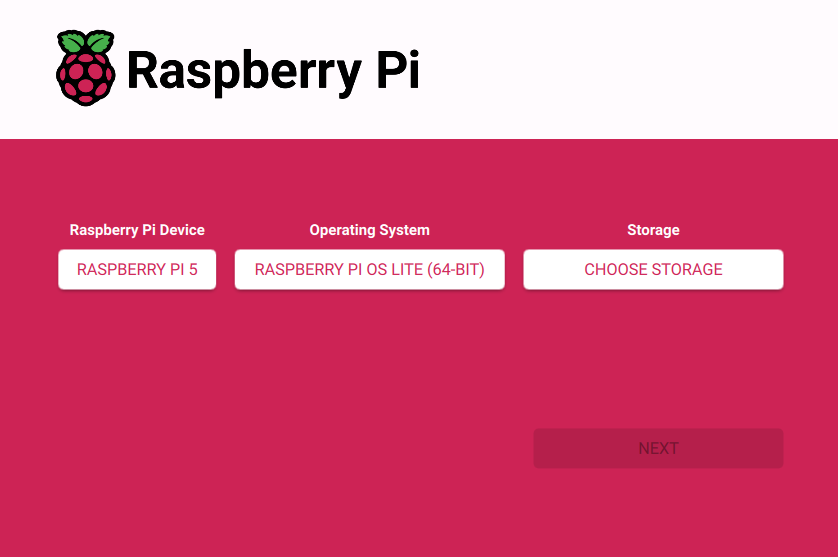

## Prerequisites


| Item                              | Price    |
|-----------------------------------|----------|
| Raspberry Pi 5 8 GB               | $79.99   |
| 128GB Micro SD Card               | $0.01    |
| Raspberry Pi Active Cooler        | $7.99    |
| Raspberry Pi 5 Case Black         | $9.99    |
| Raspberry Pi 45W USB-C Power Supply| $14.99  |
| Gourmet I Pocky Green Tea         | $2.99    |
| Tax                               | $6.96    |
| **Total**                         | **$122.92** |

Here is a list of all the things I bought. All of these besides the case is pretty much required to have. Assembly is pretty easy. If you've ever built a lego set in your life no instructions are needed. 

## Step 1: Set Up Raspberry Pi

### 1.1 Flash the OS

- On a main computer, download the <a href="https://www.raspberrypi.com/software/" style="color: green; font-weight: bold;">Raspberry Pi Imager</a>.
- Choose:
  - OS: Raspberry PI OS Lite (64-bit)
  - Storage: Your SD card 
- Enable SSH:
  - Click (settings) and enabled SSH and set username/password
- Flash and insert into Raspberry Pi
- Set up Wifi (or you can use ethernet)


### 1.2 First Boot & Updates 
- On another device, lets call this Main Computer, SSH into your Pi 

```bash
ssh username@raspberrypi.local
# enter your password
```
- After you've successfully SSHed into the Pi
```bash
sudo apt update && sudo apt full-upgrade -y
sudo apt install git curl -y
```

## Step 2: Install Docker & Docker Compose

```bash
curl -fsSL https://get.docker.com -o get-docker.sh
sudo sh get-docker.sh
sudo usermod -aG docker $USER
#logout and back in, then install Docker Compose
sudo apt install docker-compose -y
```

## Step 3: Set Up Nginx Proxy Manager (NPM)
### 3.1 Create Docker Compose File 
- We will be following this guide here: <a href="https://nginxproxymanager.com/guide/#quick-setup" style="color: green; font-weight: bold;">Nginx Proxy Manager Guide</a>.
```bash
mkdir ~/nginx-proxy-manager && cd ~/nginx-proxy-manager
#I'm a big vi fan but you can use nano (you have have to install vi)
vi docker-compose.yml
```
- Paste this into docker-compose.yml

```yaml
services:
  app:
    image: 'jc21/nginx-proxy-manager:latest'
    restart: unless-stopped
    ports:
      - '80:80'
      - '81:81'
      - '443:443'
    volumes:
      - ./data:/data
      - ./letsencrypt:/etc/letsencrypt
```
### 3.2 Run NPM
```bash
docker-compose up -d
```
- You need your PI IP Address. 
```bash
hostname -I 
```
- You should now be able to access it via you Main Computer
```cpp
http://<your-pi-ip>:81
```
- Default login is: 
```makefile
Email: admin@example.com
Password: changeme
```

## Step 4: Set Up VaultWarden
### Create Folder and Compose File 
- Back on the terminal for your Pi. Go back to your root folder 
```bash
mkdir ~/vaultwarden && cd ~/vaultwarden
vi docker-compose.yml
```
```yaml
services:
  vaultwarden:
    image: vaultwarden/server:latest
    container_name: vaultwarden
    restart: unless-stopped
    environment:
      DOMAIN: "https://vault.yourdomain.com"
    volumes:
      - ./vw-data/:/data/
    ports:
      - 80:80
```
```bash
docker-compose up -d
```
## Step 5: Connect Domain with Cloudflare 
### 5.1 Add your Domain To Cloudflare
- Go to <a href="https://dash.cloudflare.com/" style="color: green; font-weight: bold;">Cloudflare Dashboard</a>.
- Add your domain and change your registrar's nameservers to Cloudflare's 

### 5.2 Create A Record
- Go to DNS > Add Record:
- Type: A
- Name: vault (ie. vault.yourdomain.com)
- Conect: Your home's public IP
- TTL: Auto
- Proxy: Enabled 

## Step 6: Configure Port Forwarding 
- In your router settings:
  - Forward port 80 and 443 to your Pi's IP 

## Step 7: Use Nginx Proxy Manager to Set SSL
- Go to NPM UI https://<pi-ip>:81
- Click Proxy Hosts > Add Proxy Host
  - Domain: vault.yourdomain.com
  - Forward Hostanme/IP: vaultwarden
  - Forward Port: 80
  - Block common Exploits: on
  - Websockets: on
- SSL Tab:
  - Request SSL Certificate (Let's Encrypt)
  - Force SSL: on 
- Save

## Step 8: Test
- Go to https://vault.yourdomain.com 
- You should see the Vaultwarden login page secured with HTTPS! 
